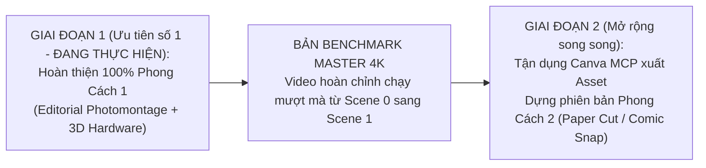

# BÁO CÁO AUDIT CHIẾN LƯỢC: ĐỊNH HƯỚNG NGHỆ THUẬT, TÍCH HỢP CANVA MCP & LỘ TRÌNH 2 PHONG CÁCH

> **Mục tiêu tài liệu:** Đồng bộ hóa toàn bộ thông tin chiến lược được thảo luận và thống nhất giữa Người dùng (Art Director / System Architect) và Agent trong phiên làm việc. Tài liệu này là kim chỉ nam cho tất cả các phiên Agent tiếp theo để giữ tính nhất quán, không phân vân hay đảo lộn định hướng giữa chừng.

---

## 1. TỔNG QUAN PHIÊN LÀM VIỆC & BỐI CẢNH TIẾP QUẢN

- **Dự án:** Video Quảng Cáo Hệ Thống Bán Bảo Hiểm TOPbaohiem & InsureGO CMS (2K/4K 60fps).
- **Trạng thái thực thi:** Terminal đang chạy `bun start` Remotion preview liên tục.
- **Nguyên tắc cốt lõi đã quán triệt:**
  1. *Git Rules:* Chỉ commit/push khi người dùng ra lệnh trực tiếp; tuyệt đối bảo vệ `staged changes`.
  2. *Laser Focus:* Tập trung đúng file và vị trí được chỉ điểm, không làm lan man.
  3. *Quy trình Test:* Không tự ý chạy browser subagent/preview ngầm làm tốn tài nguyên; người dùng trực tiếp nghiệm thu trên màn hình thực tế và feedback để sửa ngay tại chỗ.
  4. *Kịch bản động (Agile & Open Duration):* Vừa dựng vừa tinh chỉnh, không giới hạn thời lượng, ưu tiên chất lượng visual đỉnh cao.

---

## 2. KẾT NỐI VÀ XÁC THỰC CANVA MCP THÀNH CÔNG

Hệ thống đã tích hợp và kiểm thử trực tiếp máy chủ **Canva MCP Server** (`https://mcp.canva.com/mcp`):

- **Trạng thái:** Kết nối thành công 100%, xác thực đầy đủ quyền với tài khoản Canva của người dùng.
- **Bộ công cụ sẵn sàng:** 49 MCP tools (tìm kiếm, đọc nội dung, trích xuất thumbnail, xuất thiết kế, chỉnh sửa layout...).
- **Thiết kế trọng tâm đã đọc:**
  - **Tên thiết kế:** `Video Quảng Cáo Phần Mềm Bảo Hiểm`
  - **Design ID:** `DAHXeqlNPGA`
  - **Canva Shortlink:** `https://canva.link/lcfwct7607fihpp`
  - **Bản chất ý tưởng:** Toàn bộ cấu trúc kịch bản và visual trong thiết kế Canva này **do chính Người dùng chỉ điểm và định hướng**, thể hiện sự thấu hiểu sâu sắc sản phẩm TOPbaohiem và hệ thống quản trị CMS.

---

## 3. PHÂN TÍCH SO SÁNH 2 PHONG CÁCH DỰNG VIDEO (ART DIRECTION)

Người dùng và Agent đã rà soát và so sánh chuyên sâu 2 phong cách tiếp cận visual:

| Tiêu Chí So Sánh | Phong Cách 1: Mixed-Media Photomontage (Remotion Hiện Tại) | Phong Cách 2: Craft Paper Cut & Commercial Vector (Canva Storyboard) |
| :--- | :--- | :--- |
| **Ngôn ngữ thị giác** | **Người thật (Live-action cutout)** kết hợp Đồ họa 2.5D, Comic stickers và 4 đám mây suy nghĩ lớn ở 4 góc. | **Nhân vật hoạt họa 2.5D** diện áo hồng nhận diện thương hiệu, kết hợp nghệ thuật **giấy xé thủ công (Paper Cut / Torn Paper Note)**, kẹp ghim và washi tape. |
| **Hành động dẫn dắt** | Nhân vật người thật cầm điện thoại băn khoăn; 4 đám mây bay ra trung tâm để đọc rõ rồi dạt về 4 góc. | Nhân vật cầm điện thoại $\rightarrow$ **Búng tay (Snap)** $\rightarrow$ Ý tưởng lóe sáng $\rightarrow$ Dải lụa sóng hồng mở ra màn hình Laptop ngay bên cạnh. |
| **Cảm xúc mang lại** | Nghiêm túc, đĩnh đạc, tính xã hội cao, rành mạch thông tin, phù hợp khách hàng tài chính và nhà đầu tư. | Trẻ trung, hóm hỉnh, duyên dáng, đậm chất giải trí và thân thiện của các TVC thương mại truyền hình. |
| **Tiến độ code thực tế** | **Đã hoàn thiện ~70%** (File `Scene0ProblemHook.tsx` và `Scene1Hook.tsx` đã dựng chi tiết, có sẵn WebP 3D mở nắp laptop, iPhone 16 Pro mockup). | **Mới có Storyboard trên Canva**, chưa có mã nguồn chuyển động trong Remotion. |
| **Nút thắt kỹ thuật** | Cần hiệu ứng gom 4 đám mây và fade out người thật để chuyển sang màn mở nắp MacBook ở Scene 1. | Cần dùng Canva MCP xuất toàn bộ tài nguyên (nhân vật, giấy xé, dải sóng) về `public/assets/` và code hoạt cảnh búng tay từ đầu. |

---

## 4. QUYẾT ĐỊNH CHIẾN LƯỢC TỐI HẬU: LỘ TRÌNH 2 GIAI ĐOẠN

Nhằm tránh việc phân vân kéo dài làm chậm trễ tiến độ dự án và tránh rơi vào bẫy "bỏ dở để bắt đầu lại từ đầu", **Người dùng và Agent đã thống nhất quyết định chiến lược như sau**:

### Chi tiết lộ trình:

1. **GIAI ĐOẠN 1 (Ưu tiên tuyệt đối): Hoàn thiện dứt điểm Phong Cách 1**
   - **Mục tiêu:** Tận dụng 70% khối lượng công việc đã làm để về đích sớm nhất.
   - **Nhiệm vụ trọng tâm:** Ráp nối chuyển cảnh từ phần kết của Scene 0 (khi 4 đám mây đã ở 4 góc) sang phần mở đầu của Scene 1 (cú mở nắp MacBook Pro 3D), đảm bảo nhịp điệu mượt mà, không đứt gãy.
   - **Kết quả đầu ra:** Một bản video 4K chạy hoàn chỉnh từ đầu đến đuôi để người dùng kiểm tra thực tế trên `bun start` và nghiệm thu sản phẩm.

2. **GIAI ĐOẠN 2 (Triển khai tiếp nối): Xây dựng Phong Cách 2 từ Canva Storyboard**
   - **Mục tiêu:** Tạo thêm một phiên bản Video thương mại phong cách Paper Cut tươi vui theo đúng bản vẽ thiết kế trên Canva.
   - **Phương pháp thực hiện:**
     - Sử dụng công cụ Canva MCP (`export-design`, `get-assets`) để xuất các layer đồ họa chuẩn nét trực tiếp vào repo.
     - Tạo một Composition độc lập (ví dụ `Scene0_PaperCut`) để không làm ảnh hưởng đến Phong cách 1.

---

## 5. BẢNG KHỚP NỐI CHI TIẾT 6 NHỊP KỊCH BẢN CHUẨN LÊN VIDEO (MASTER 6-ACT MAPPING)

Để khắc phục tình trạng phân cảnh 1 và 2 trước đây chưa ăn khớp hoặc bị chồng chéo, Người dùng và Agent đã chuẩn hóa toàn bộ dòng chảy video thành 6 nhịp kịch bản rõ ràng, tận dụng triệt để mã nguồn và kho tài nguyên 4K sẵn có:

| Nhịp Kịch Bản Chuẩn | Vai Trò Nội Dung | Phương Án Triển Khai & Khớp Nối Mã Nguồn |
| :--- | :--- | :--- |
| **Nhịp 1: Băn khoăn** | Nỗi đau ma trận bảo hiểm truyền thống | **Scene 0 hiện tại** (`Scene0ProblemHook.tsx`): Cô gái người thật + 4 đám mây câu hỏi bối rối dạt về 4 góc. |
| **Nhịp 2: Búng tay tìm ra TOPbaohiem** | Khoảnh khắc Eureka bừng sáng | **Đặt ở cuối Scene 0**: Búng tay *Snap!* $\rightarrow$ Đón chiếc MacBook 3D mở nắp thức tỉnh màn hình Liquid Retina của **Scene 1** (`Scene1Hook.tsx`). |
| **Nhịp 3: Các câu chuyện bảo hiểm vui nhộn** | Tiểu cảnh đời thường (Du lịch biển, xe cộ, sức khỏe...) | Biến các thẻ bung ra của **Scene 1** hoặc cánh lật **Scene 2** thành các câu chuyện nhỏ sinh động, sau đó **thu gọn về đúng thẻ sản phẩm trên website**. |
| **Nhịp 4: Website xử lý đơn giản 1-chạm** | Quy trình mua thật trên web (Chọn $\rightarrow$ So sánh $\rightarrow$ Điền $\rightarrow$ Cấp đơn) | Lướt giao diện thật trên màn hình MacBook & iPhone Retina (kho tư liệu 4K: `compare_matrix.png`, `checkout_ocr_form.png`, `ecertificate_result.png`). |
| **Nhịp 5: CMS vận hành phía sau** | Cỗ máy ngầm quản trị tự động cho nhà đầu tư | Lật không gian 3D sang **CMS Dashboard Dark Mode** (`dashboard_panoramic.png`, `contracts_list.png`, cây hoa hồng `kol_tree.png`). |
| **Nhịp 6: Thông điệp kết & CTA** | Khẳng định giải pháp toàn diện | Logo TOPbaohiem + Hệ sinh thái đa thiết bị (Web + Mobile + CMS) + Kêu gọi hành động / đầu tư sở hữu nền tảng. |

---

## 6. HIỆN THỰC HÓA BẢN PHÁC THẢO TOÀN CẢNH (MASTER STORYBOARD DRAFT 4K)

Đã khởi tạo thành công Composition phác thảo toàn bộ 6 nhịp kịch bản trực tiếp trên Remotion preview:
- **File thành phần:** [MasterStoryboardDraft.tsx](file:///Users/phamminhtri/Desktop/project/quancao-topbaohiem/src/components/scenes/MasterStoryboardDraft.tsx)
- **Đăng ký trong Remotion:** [Root.tsx](file:///Users/phamminhtri/Desktop/project/quancao-topbaohiem/src/Root.tsx) với ID `MasterStoryboardDraft4K` (2600 frames @ 60fps ~ 43.3 giây).
- **Thanh điều hướng HUD:** Tích hợp HUD Tracker trên cùng hiển thị tiến trình của 6 hồi thời gian thực giúp kiểm tra nhịp điệu (pacing) và visual từ 0s đến hết video.

---

## 7. NHIỆM VỤ KỸ THUẬT TIẾP THEO (NEXT ACTION ITEMS)

Bất kỳ Agent nào tiếp tục phiên làm việc cần bám sát hành động sau:
- **Tập trung vào Giai đoạn 1**: Không đề xuất chuyển sang Phong cách 2 trước khi Phong cách 1 hoàn thành 100%.
- **Vị trí xử lý code tiếp theo:**
  - Nhận feedback từ người dùng sau khi xem bản phác thảo `MasterStoryboardDraft4K`.
  - Tinh chỉnh chi tiết hoạt ảnh chuyển tiếp Búng tay (Act 2) và tiểu cảnh vui nhộn (Act 3).
  - Tích hợp hoàn thiện vào Master Video chính thức.
