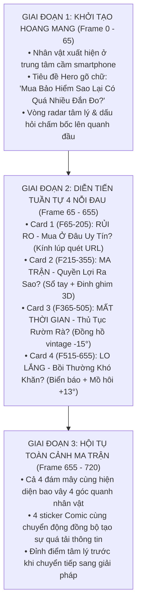

# Hồ Sơ Thiết Kế & Kiểm Định Toàn Diện Màn 0: Problem Hook (Scene 0)

> **Mục tiêu tối thượng của Scene 0:** Đánh trúng tim đen nỗi đau (Pain Points) của người tiêu dùng khi tìm mua bảo hiểm truyền thống tại Việt Nam: ma trận thông tin, thủ tục rườm rà, quyền lợi mập mờ, lo ngại bồi thường. Tạo cú hích tâm lý mạnh mẽ để chuyển tiếp sang giải pháp công nghệ **TOPBAOHIEM** ở Màn 1.

---

## I. Ý Đồ Gốc & Tuyên Ngôn Nghệ Thuật (Design Manifesto)

### 1. Trích dẫn nguyên văn chỉ đạo & phản hồi từ User:
> *"Mình đã bỏ hết các gạch đầu dòng mô tả rồi, chỉ còn các nội dung chính thôi, nên việc bóng chat chứa nội dung của cụm nội dung chính nó vô tư bạn ạ, ko bị chèn ép nội dung đâu, nên theo mình cứ lấy bong chat hình mình gửi làm UI đồ họa luôn."*
>
> *"Mình có ý tưởng bổ sung các icon động cho mỗi bóng chat: ví dụ ở bóng chat mất thời gian, hiện nó đang nằm ở góc dưới bên trái của cụm 4 box chat, mình sẽ thêm ngay phía trên bên trái của bóng chat đó 1 cái đồng hồ 'reng reng' động, kiểu đồng hồ phong cách comic... các phần khác cũng tương tự."*
>
> *"Đổi cái đồng hồ mình tải vào xem thử nhé, nghiêng trục đồng hồ sang trái 15 độ, tạo độ lắc nhẹ là được rồi."*
>
> *"Kính lúp thì hiệu ứng của nó kiểu chạy dài mềm mại theo hướng ngang, mỗi lần nó quét qua là hiện địa chỉ trang web kiểu www://baohiem... ý tưởng mình là vậy."*
>
> *"Tăng kích thước cái icon sổ tay và đinh ghim lên giúp mình nhé."*
>
> *"Tương tự tăng kích thước cho icon này (biển cảnh báo + mồ hôi), và tạo độ nghiêng nhẹ sang phải nữa bạn nhé."*

### 2. Chuyển hóa thành ngôn ngữ Motion Design & Visual Identity:
* **Ngôn ngữ Comic Pop-Art kịch tính:** Sử dụng nét viền mực đen dày dặn (`#0f172a`), bóng đổ dập khối offset (`box-shadow: 4px 6px 0px #0f172a`), đám mây suy nghĩ lượn múi mềm mại với các vòng tròn dẫn hướng (Thought Bubbles).
* **Nhân vật trung tâm hoang mang (Confused Persona):** Cô gái trẻ cầm smartphone với nét mặt đắn đo, bối rối (`character-confused-cutout.png`), vòng sóng radar suy nghĩ và dấu chấm hỏi phát sáng xoay quanh đầu.
* **Cơ chế Spotlight Sequential Docking:** Thay vì bung ra cùng lúc khiến người xem bị ngợp và không kịp đọc, 4 nỗi đau xuất hiện **lần lượt** tại trung tâm màn hình (phóng to, độ tương phản cao), dừng lại đủ lâu (*dwell time*) để đọc, sau đó lướt mượt mà về 4 góc (Docking) để nhường tâm điểm cho nỗi đau tiếp theo.
* **Bộ tứ Sticker Comic sống động (Interactive Comic Stickers):** Mỗi bóng chat sở hữu 1 sticker đặc thù kể câu chuyện riêng:
  1. **Top-Left (RỦI RO):** Kính lúp vintage quét ngang thanh URL search bar mini, liên tục đổi địa chỉ web hoang mang.
  2. **Top-Right (MA TRẬN):** Cuốn sổ tay ma trận lò xo, tab chỉ mục chi chít điều khoản kèm chiếc đinh ghim bấm đỏ khổng lồ 3D (Giant Red Pushpin) rung lắc nhẹ.
  3. **Bottom-Left (MẤT THỜI GIAN):** Đồng hồ hai chuông vintage nghiêng $-15^\circ$, rung reng reng báo động gấp gáp.
  4. **Bottom-Right (LO LẮNG):** Biển báo tam giác cyan nghiêng phải $+13^\circ$ kèm giọt mồ hôi 3D toát ra căng thẳng.

---

## II. Cấu Trúc Nhịp Điệu (The 5-Phase Narrative)



---

## III. Dữ Liệu Chi Tiết 4 Nỗi Đau (The 4 Pain Point Cards)

| Thuộc tính | Card 1 (Top-Left) | Card 2 (Top-Right) | Card 3 (Bottom-Left) | Card 4 (Bottom-Right) |
| :--- | :--- | :--- | :--- | :--- |
| **Pill / Badge** | `RỦI RO` (Vàng hổ phách `#f59e0b`) | `MA TRẬN` (Đỏ tươi `#ef4444`) | `MẤT THỜI GIAN` (Xanh tím `#6366f1`) | `LO LẮNG` (Xanh cyan `#06b6d4`) |
| **Tiêu đề chính** | **Mua Ở Đâu Uy Tín?** | **Quyền Lợi Ra Sao?** | **Thủ Tục Cấp Đơn Rườm Rà?** | **Bồi Thường Có Khó Khăn?** |
| **Timeline Spotlight** | Pop: F65 \| Hold: F180 \| Dock: F205 | Pop: F215 \| Hold: F330 \| Dock: F355 | Pop: F365 \| Hold: F480 \| Dock: F505 | Pop: F515 \| Hold: F630 \| Dock: F655 |
| **Sticker Comic** | `MagnifyingComicSticker` | `ContractComicSticker` | `AlarmClockComicSticker` | `WarningSweatComicSticker` |
| **Hành vi động** | Kính lúp trượt ngang `scanX`, thanh URL đổi `www://baohiem...` | Sổ tay lò xo, tab chỉ mục, đinh ghim $R=35\text{px}$ rung nhẹ `pinWiggle` | Đồng hồ vintage nghiêng $-15^\circ$, rung lắc `bellShake` $\pm 6^\circ$ | Biển tam giác nghiêng $+13^\circ$, giọt mồ hôi 3D nhấp nhô `sweatY` |
| **Kích thước size** | Spotlight: `130*s` \| Dock: `105*s` | Spotlight: `250*s` \| Dock: `205*s` | Spotlight: `135*s` \| Dock: `110*s` | Spotlight: `240*s` \| Dock: `195*s` |
| **Tọa độ gác mây** | `top: -4%`, `left: 22%` | `top: -8%`, `right: 9%` | `top: -7%`, `left: 13%` | `top: -8%`, `right: 9%` |

---

## IV. Kiến Trúc Mã Nguồn & Triển Khai Kỹ Thuật

### 1. Bản đồ cấu trúc File:
* [Scene0ProblemHook.tsx](file:///Users/phamminhtri/Desktop/project/quancao-topbaohiem/src/components/scenes/Scene0ProblemHook.tsx):
  - Component phân cảnh chính của Scene 0.
  - Chứa thuật toán tính toán vị trí, kích thước, hiệu ứng lò xo `spring()` của từng card:
    - `popProgress`: Hiệu ứng nảy lò xo xuất hiện tại tâm.
    - `dockProgress`: Quá trình chuyển dịch từ tâm về góc tọa độ màn hình (`cornerKey`).
    - `CLOUD_PATH_D`: Vector path SVG dựng hình đám mây suy nghĩ bồng bềnh chuẩn Comic Pop-Art.
* [ComicStickers.tsx](file:///Users/phamminhtri/Desktop/project/quancao-topbaohiem/src/components/ui/ComicStickers.tsx):
  - Chứa 4 component sticker hoạt hình độc lập:
    - `MagnifyingComicSticker`: Kính lúp vintage kèm thanh search URL bar.
    - `ContractComicSticker`: Cuốn sổ tay ma trận điều khoản + Đinh ghim đỏ 3D khổng lồ.
    - `AlarmClockComicSticker`: Đồng hồ báo thức vintage rung chuông.
    - `WarningSweatComicSticker`: Biển báo tam giác + Giọt mồ hôi 3D nghiêng phải.
* **Tài nguyên ảnh (Assets):**
  - `public/assets/character-confused-cutout.png`: Ảnh nhân vật tách nền chất lượng cao.
  - `public/assets/dong-ho-vintage-sticker.png`: Đồng hồ báo thức hai chuông kiểu cổ.
  - `public/assets/kinh-lup-vintage-sticker.png`: Kính lúp cán đồng vintage.

### 2. Thuật toán vị trí & Tỷ lệ động (Responsive Scale `s`):
```tsx
const s = Math.min(width / 1920, height / 1080);
```
Mọi thông số về font chữ, viền nét vẽ (`strokeWidth`), kích thước đám mây và sticker đều nhân với hệ số tỉ lệ `s` để đảm bảo hiển thị sắc nét đồng nhất từ Full HD (1080p), 2K đến 4K.

---

## V. Lưu Ý Quan Trọng Cho Các Agent Sau (Crucial Knowledge)

> [!WARNING]
> 1. **Tuyệt đối không nhồi nhét lại gạch đầu dòng vào đám mây**: User đã chỉ định dứt khoát chỉ giữ lại cụm chữ tiêu đề ngắn gọn (ví dụ: *"Thủ Tục Cấp Đơn Rườm Rà?"*), không thêm text dài làm vỡ bố cục Comic.
> 2. **Tương quan kích thước các Sticker**: Cả 4 sticker hiện đã được cân bằng kích thước thị giác (visual balance). Sổ tay và Biển báo tam giác có `size ~ 195 - 205*s` (vì là hình vẽ SVG trong bounding box rộng), còn Đồng hồ và Kính lúp có `size ~ 105 - 110*s` (vì asset PNG chiếm trọn bounding box). Nếu thay đổi, phải kiểm tra visual render still để tránh lệch tỉ lệ.
> 3. **Tọa độ gác mây (`top`, `right`/`left`)**: Các sticker đang được gác nhô ra ngoài mép mây một cách tự nhiên (overlapping 30-40%). Không thụt quá sâu vào trong đám mây vì sẽ đè lên badge tiêu đề.
> 4. **Nguyên tắc Commit**: Chỉ commit khi User yêu cầu rõ ràng. Luôn chạy `bunx tsc --noEmit` và render still bằng `bunx remotion still` để xác thực trước khi kết luận hoàn thành.
