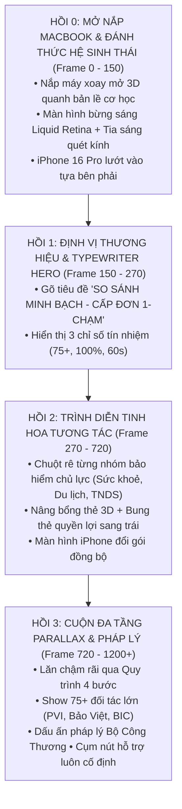

# Kế Hoạch Trình Diễn Tinh Hoa Màn 1: Interactive Product Showcase (TOPBAOHIEM)

> **Mục tiêu tối thượng:** Biến Màn 1 thành cú hích thị giác *"cực mạnh"*, thể hiện trọn vẹn tinh hoa của nền tảng **TOPBAOHIEM**. Bắt đầu bằng khoảnh khắc điện ảnh mở nắp laptop 3D đánh thức màn hình Retina, kết hợp trình diễn tương tác rê chuột sống động, chậm rãi và đĩnh đạc để người xem kịp đọc, ngắm nhìn và trải nghiệm sự tiện lợi vượt trội.

---

## I. Ý Đồ Gốc & Tuyên Ngôn Nghệ Thuật (Design Manifesto)

### 1. Trích dẫn nguyên văn định hướng từ User:
> *"Phần màn 1 này cực quan trọng nó là phần nội dung 'cực mạnh' đánh vào thị giác người xem, để quảng bá và show tinh hoa trang chủ lên."*
>
> *"Các nội dung cần thể hiện mạnh mẽ, hiệu ứng mạnh, nhưng trình diễn phải rõ ràng và chậm đủ để người xem đọc nhìn và trải nghiệm."*
>
> *"Ví dụ: khi ở phần đầu tiên, ảnh gốc trên trang chủ mình chụp ảnh 1, mình cần các hiệu ứng rê chuột vào từng loại bảo hiểm, khi đó sẽ có hiệu ứng thu phóng nội dung hoặc hình ảnh loại bảo hiểm đó được thu phóng lên sang trái hoặc đại khái sẽ có hiệu ứng để trình diễn nội dung của từng loại bảo hiểm, không đi sâu, chỉ là bề nổi giúp hiệu ứng show các nhóm loại bảo hiểm được mạnh hơn."*
>
> *"Trước bước 1 nên xây dựng hiệu ứng gập mở laptop bạn thấy thế nào ạ, sau khi các hiệu ứng xuất hiện iPhone và mở laptop rồi mới đến bước 1 hiện tại."*
>
> *"Chưa cần fix quá chi tiết các vấn đề, cứ làm tổng quát trước, khi có demo rồi mới đi sâu vào xử lý chi tiết."*

### 2. Diễn giải và chuyển hóa thành ngôn ngữ Motion Design:
* **Khởi đầu điện ảnh (Cinematic Hardware Opening):** Không mở màn bằng một giao diện đã có sẵn tĩnh tại. Khán giả được chiêm ngưỡng chiếc MacBook Air M3 gập nắp từ từ mở dựng lên trong không gian 3D, màn hình bừng sáng thức giấc, iPhone lướt vào tiếp ứng. Cảm giác như chính người dùng đang chạm tay mở máy khám phá TOPBAOHIEM.
* **Không làm video quay màn hình thụ động:** Không vội vàng cuộn trang ngay từ đầu; trang chủ là một **Live Interactive Canvas** (không gian tương tác sống động).
* **Định luật Pacing (Nhịp điệu điện ảnh):** Tương tác rê chuột phải có độ trễ tự nhiên (*momentum*), có điểm dừng nghỉ (*dwell time*) đủ để mắt người xem cảm nhận từng nhóm bảo hiểm.
* **Đa chiều không gian (Spatial Depth):** Tận dụng tối đa khoảng trống thoáng đãng bên trái giữa MacBook và cột chữ để bung nở thẻ chi tiết nổi (*Floating Feature Lens*), tạo chiều sâu 3D đẳng cấp.
* **Đồng bộ hệ sinh thái (Apple Ecosystem Synergy):** Chiếc iPhone bên phải không đứng yên làm nền, mà phản hồi đồng bộ tức thì với thao tác chuột trên MacBook.

---

## II. Cấu Trúc Nhịp Điệu Màn 1 (The 4-Act Structure)

---

## III. Chi Tiết Kịch Bản Từng Hồi

### 1. HỒI 0: Hiệu Ứng Gập Mở Nắp Laptop & iPhone Xuất Hiện (Frame 0 - 150 / 0.0s - 2.5s)
* **Trạng thái khởi đầu (Frame 0 - 30):**
  - Mâm nhôm MacBook màu Silver đầm chắc đã nằm ổn định trên mặt phẳng.
  - Nắp máy trên (Display Lid) đang ở trạng thái hé mở góc thấp (`rotateX: 78deg`, trục xoay `transformOrigin: 'bottom center'`).
  - Màn hình ở trạng thái đen bóng phản chiếu ánh sáng môi trường nhẹ.
* **Chuyển động mở nắp (Frame 30 - 120):**
  - Nắp máy được nâng bổng lên từ từ bằng hàm lò xo điện ảnh (`spring` damping 15, mass 1.2), mở dựng từ góc `78deg` về góc chuẩn `0deg`.
  - Bóng đổ phía sau mâm máy và mặt sàn biến đổi sống động theo góc mở của nắp máy.
* **Đánh thức màn hình (Screen Ignition & Backlight, Frame 60 - 120):**
  - Khi nắp mở qua góc 45°, đèn nền Liquid Retina kích hoạt bừng sáng (độ sáng và độ tương phản tăng từ 0% lên 100%).
  - Dải tia sáng phản quang kim loại (*Specular Sheen*) quét một đường chéo tinh tế qua mặt kính Retina.
* **iPhone 16 Pro lướt vào tiếp ứng (Frame 80 - 150):**
  - Khi nắp laptop sắp hoàn tất góc mở, chiếc iPhone 16 Pro lướt êm ái từ phía bên phải vào vị trí góc phải mâm máy với độ xoay `rotateY(-8deg)`.
  - Cả hai thiết bị hòa vào một bố cục đôi hoàn hảo.

---

### 2. HỒI 1: Định Vị Thương Hiệu & Gõ Chữ Hero (Frame 150 - 270 / 2.5s - 4.5s)
* Cột chữ bên trái kích hoạt hiệu ứng Typewriter với con trỏ nhấp nháy magenta:
  - Dòng 1: **SO SÁNH MINH BẠCH**
  - Dòng 2: **CẤP ĐƠN 1-CHẠM**
* 3 thẻ thống kê bảo chứng uy tín xuất hiện: `75+ Đối Tác`, `100% Cấp Đơn Online`, `60s Xử Lý Siêu Tốc`.

---

### 3. HỒI 2: Trình Diễn Tinh Hoa Tương Tác (Frame 270 - 720 / 4.5s - 12.0s)

#### Phân cảnh 2.1: Spotlight "Bảo Hiểm Sức Khoẻ" (Sản phẩm Flagship)
* **Chuyển động chuột:** Con trỏ chuột lướt êm ái từ tâm màn hình MacBook xuống thẻ **Bảo hiểm Sức khoẻ**.
* **Phản hồi trên thẻ:**
  - Viền thẻ phát sáng viền neon hồng magenta (`#ed017c`).
  - Toàn bộ thẻ nâng bổng 3D nhẹ (`translateZ(25px)` + bóng đổ mềm lan tỏa).
  - Biểu tượng 3D (ống nghe y tế & khiên tim) nảy nhẹ và phóng lớn 15%.
* **Hiệu ứng bung sang trái (Floating Feature Lens):**
  - Một thẻ kính mờ cao cấp (*Liquid Glassmorphism Card*) bung nở từ thẻ bay sang khoảng trống bên trái (giữa cột chữ và MacBook).
  - Hiển thị 3 chỉ số quyền lợi vàng:
    - 🏥 **Bảo Lãnh Viện Phí:** 250+ bệnh viện quốc tế hàng đầu.
    - ⚡ **Bồi Thường Online:** 100% qua app trong 24h.
    - 💰 **Tiết Kiệm Tối Đa:** Tối ưu tới 40% biểu phí.
* **Đồng bộ iPhone:** Màn hình iPhone bên phải trượt mượt sang danh sách so sánh các gói: *Bảo Long Bronze, Bảo Việt An Gia*.
* **Tương tác click:** Chuột click nhẹ $\rightarrow$ vòng tròn sóng chạm (*Ripple Click Wave*) lan tỏa.

#### Phân cảnh 2.2: Chuyển tiếp sang "Bảo Hiểm Du Lịch & Cháy Nổ"
* **Chuyển động chuột:** Chuột lướt tiếp sang thẻ **Bảo hiểm Du lịch**.
* **Phản hồi giao diện:**
  - Thẻ Sức khoẻ nhẹ nhàng hạ cánh về vị trí cũ.
  - Thẻ Du lịch bừng sáng, cụm vali hồng + máy bay 3D chuyển động nổi bật.
  - Thẻ chi tiết bên trái chuyển đổi nội dung: *Bảo vệ chuyến bay, hồi hương y tế khẩn cấp, bảo hiểm hành lý toàn cầu*.
  - iPhone lướt nhẹ sang gói bảo hiểm du lịch quốc tế.
* **Thời gian dừng (Dwell time):** Giữ khoảng 60 - 75 frames (1 - 1.25 giây) để người xem kịp đọc và ghi nhớ.

#### Phân cảnh 2.3: Nhóm phương tiện "Bảo Hiểm TNDS Ô Tô & Xe Máy" (Cấp đơn 60s)
* **Chuyển động chuột:** Chuột lướt xuống hàng dưới, chạm vào **TNDS Ô tô / Xe máy**.
* **Hiệu ứng:** 
  - Đánh dấu ấn chỉ điện tử QR chuẩn Thông tư 04/2021/TT-BTC.
  - Thẻ thông số cột trái nhấp nháy sáng thẻ `60s Xử Lý Siêu Tốc`.

---

### 4. HỒI 3: Cuộn Đa Tầng Parallax & Pháp Lý (Frame 720 - 1200+ / 12.0s - 20.0s+)
* Toàn bộ website bắt đầu lăn mượt mà (*Parallax Momentum Scroll*):
  - Lướt qua Quy trình mua bảo hiểm 4 bước trực quan.
  - Dừng nhẹ ở mạng lưới 75+ đối tác lớn (PVI, Bảo Việt, BIC, PTI, PJICO).
  - Chạm đáy chân trang với chứng nhận Bộ Công Thương.
* **Cụm nút Hỗ trợ & Giỏ hàng:** Luôn nằm cố định chuẩn mực ở góc dưới bên phải màn hình MacBook suốt quá trình cuộn trang.

---

## IV. Bảng Phân Bổ Khung Hình (Timeline & Frame Budgeting @ 60FPS)

| Giai Đoạn | Frame Range | Thời Gian | Hành Động & Trọng Tâm Thị Giác |
| :--- | :---: | :---: | :--- |
| **Hồi 0: Unfold & Wake** | `0 - 150` | 0.0s - 2.5s | Nắp MacBook mở xoay 3D; màn hình bừng sáng; iPhone lướt vào góc phải. |
| **Hồi 1: Hook & Brand** | `150 - 270` | 2.5s - 4.5s | Gõ tiêu đề *SO SÁNH MINH BẠCH - CẤP ĐƠN 1-CHẠM*; hiển thị 3 chỉ số uy tín. |
| **Hồi 2.1: Sức Khoẻ** | `270 - 430` | 4.5s - 7.2s | Chuột rê vào thẻ Sức khoẻ; bung thẻ chi tiết sang trái; iPhone đổi gói Sức khoẻ. Click nhẹ. |
| **Hồi 2.2: Du Lịch** | `430 - 580` | 7.2s - 9.7s | Chuột lướt sang thẻ Du lịch; thẻ kính mờ đổi quyền lợi du lịch; chứng minh danh mục đa dạng. |
| **Hồi 2.3: TNDS & Đóng Thẻ** | `580 - 720` | 9.7s - 12.0s | Rê nhẹ qua TNDS Ô tô/Xe máy; thu gọn thẻ kính mờ; sẵn sàng cuộn trang. |
| **Hồi 3: Momentum Parallax**| `720 - 1140` | 12.0s - 19.0s| Cuộn êm ái xuống Quy trình 4 bước, 75+ đối tác lớn, FAQ và Footer Bộ Công Thương. |
| **Hồi 3.1: Climax Push-in** | `1140 - 1260`| 19.0s - 21.0s| Camera push-in điện ảnh tạo đà nối cảnh sang Scene 2. |

---

## V. Kế Hoạch Triển Khai Kỹ Thuật (Implementation Roadmap)

1. **Bước 0 (Dựng chuyển động Mở Nắp Laptop 3D & iPhone Lướt Vào):**
   - Thiết lập `transformOrigin: 'bottom center'` cho nắp máy trên.
   - Thêm góc xoay `lidAngle` mở từ `78deg` $\rightarrow$ `0deg` bằng hàm `spring`.
   - Tạo hiệu ứng độ sáng màn hình `screenBrightness` từ `0.1` $\rightarrow$ `1.0` kèm vệt sáng glare.
   - Thêm hiệu ứng slide-in cho iPhone 16 Pro từ bên phải.
2. **Bước 1 (Xây dựng khung Layer tương tác tổng quát cho Hồi 2):**
   - Lập trình quỹ đạo chuột lướt vào thẻ Sức khoẻ và Du lịch.
   - Tạo hiệu ứng nâng bổng thẻ 3D và sáng viền neon hồng.
3. **Bước 2 (Chế tác Component "Floating Feature Lens"):**
   - Dựng thẻ kính mờ tại khoảng trống bên trái (giữa cột chữ và MacBook).
   - Nội dung tóm tắt quyền lợi vàng của từng gói.
4. **Bước 3 (Đồng bộ màn hình iPhone):**
   - Đồng bộ trạng thái màn hình iPhone theo vị trí chuột trên MacBook.
5. **Bước 4 (Render bản demo & Duyệt Pacing):**
   - Xuất preview ảnh/video để duyệt nhịp điệu từ tốn, đạt chuẩn điện ảnh.
