# BÁO CÁO AUDIT TOÀN DIỆN HỆ THỐNG PHẦN MỀM BÁN BẢO HIỂM TRỰC TUYẾN TOPBAOHIEM.VN
**Phục Vụ Bộ Phận Nghiên Cứu Sản Phẩm & Sản Xuất Video Quảng Cáo Định Dạng 2K / 4K UHD**

---

## 1. TỔNG QUAN HỆ THỐNG & ĐỊNH VỊ SẢN PHẨM

- **Tên nền tảng**: TopBaoHiem (Website: `https://topbaohiem.vn/`)
- **Mô hình kinh doanh**: Nền tảng InsurTech B2C & B2B2C tổng hợp, so sánh và cấp đơn bảo hiểm trực tuyến tự động (Aggregator & Digital Brokerage).
- **Pháp lý & Chứng nhận**: Được xác nhận và chứng nhận bởi **Bộ Công Thương** (Huy hiệu sàn thương mại điện tử chính thống).
- **Công nghệ lõi**: 
  - Kiến trúc Web: Next.js (Server-Side Rendering kết hợp Dynamic Client Hydration).
  - Tích hợp AI OCR: Tự động nhận diện và trích xuất dữ liệu đăng ký xe (Cà vẹt xe máy, Giấy đăng kiểm ô tô) qua ảnh chụp.
  - Cổng thanh toán quốc gia: Tích hợp trực tiếp VNPAY-QR, Thẻ ATM nội địa, Thẻ Visa/Mastercard.
  - Hệ thống cấp ấn chỉ điện tử: Giao nhận chứng nhận bảo hiểm điện tử tức thì (e-Certificate) có mã tra cứu bảo mật theo chuẩn quy định nhà nước.

---

## 2. KIẾN TRÚC THÔNG TIN & PHÂN LOẠI 11 NHÓM CHỨC NĂNG

Hệ thống được bóc tách toàn diện từ 51 URLs theo sitemap thành 11 nhóm trang chức năng:

```mermaid
graph TD
    Root[TOPBAOHIEM.VN] --> G1[01. Trang Chủ & Hero Branding]
    Root --> G2[02. Bảo Hiểm Xe Ô Tô & Xe Máy]
    Root --> G3[03. Bảo Hiểm Sức Khỏe & Tra Cứu Y Tế]
    Root --> G4[04. Bảo Hiểm Du Lịch Quốc Tế & Nội Địa]
    Root --> G5[05. Bảo Hiểm Tài Sản & Doanh Nghiệp]
    Root --> G6[06. Ma Trận So Sánh Báo Giá Thông Minh]
    Root --> G7[07. Quy Trình Đặt Mua, AI OCR & Thanh Toán]
    Root --> G8[08. Tra Cứu Bồi Thường & CSKH 24/7]
    Root --> G9[09. Cổng Đối Tác KOL & Cộng Tác Viên]
    Root --> G10[10. Quản Lý Tài Khoản & Hợp Đồng Điện Tử]
    Root --> G11[11. Cẩm Nang Pháp Lý & Chính Sách Minh Bạch]
```

### Chi Tiết Từng Phân Hệ Chức Năng:

| STT | Nhóm Chức Năng | Các Trang Cốt Lõi | Giá Trị & Vai Trò Sản Phẩm |
|:---:|:---|:---|:---|
| **01** | **Trang Chủ & Hero Branding** | `home_main`, `home_workflow_partners` | Tạo niềm tin (Trust Anchor), huy hiệu Bộ Công Thương, 3 trụ cột giá trị (Minh bạch - Tiết kiệm - Nhanh chóng), quy trình 4 bước mua bảo hiểm. |
| **02** | **Bảo Hiểm Ô Tô & Xe Máy** | `motorbike_listing`, `motorbike_intro`, `car_tnds`, `car_material_calculator`, `car_material_valuation` | Phân hệ "Cash Cow" có lượng mua cao nhất. Cho phép tính phí TNDS bắt buộc theo loại xe (dưới 50cc, trên 50cc, ô tô không kinh doanh / chạy Grab). Công cụ thẩm định giá trị xe theo năm sản xuất để tính phí thân vỏ. |
| **03** | **Bảo Hiểm Sức Khỏe & Y Tế** | `health_calculator`, `health_intro`, `medical_network_search` | Bộ lọc quyền lợi nội trú, ngoại trú, thai sản, nha khoa. Tính năng **Tra cứu danh sách bệnh viện bảo lãnh viện phí** trên 63 tỉnh thành (Bảo Việt, PVI, Bảo Long, BIC...). |
| **04** | **Bảo Hiểm Du Lịch** | `international_travel`, `travel_intro`, `domestic_travel` | Gói du lịch quốc tế cam kết đạt 100% tiêu chuẩn xin **Visa Schengen (Châu Âu), Mỹ, Nhật Bản, Hàn Quốc**. Hỗ trợ chi phí hồi hương, hoãn hủy chuyến, thất lạc hành lý. |
| **05** | **Tài Sản & Doanh Nghiệp** | `compulsory_fire`, `compulsory_fire_intro`, `cargo`, `private_house`, `commercial_credit`, `mortgage_loan` | Phân hệ B2B: Bảo hiểm cháy nổ bắt buộc theo **Nghị định 97/2021/NĐ-CP**, bảo hiểm hàng hóa vận chuyển container đường biển/đường bộ, bảo hiểm khoản vay thế chấp. |
| **06** | **So Sánh Báo Giá Đa Hãng** | `compare_matrix_engine`, `discounts_vouchers` | **Vũ khí cạnh tranh lớn nhất**: Bảng ma trận so sánh trực quan quyền lợi - mức phí - mức khấu trừ giữa các hãng (PTI vs PVI vs Bảo Việt vs Bảo Long vs PJICO). Trung tâm voucher giảm giá. |
| **07** | **Đặt Mua, AI OCR & Thanh Toán** | `motorbike_checkout`, `car_checkout`, `health_checkout`, `travel_checkout`, `checkout_result` | Tích hợp **AI OCR Quét Cà Vẹt Xe**: Upload ảnh chụp giấy tờ, AI tự bóc tách số khung, số máy, biển số, họ tên trong 2 giây. Cổng thanh toán quốc gia VNPAY-QR. Màn hình cấp chứng nhận điện tử tức thì. |
| **08** | **Bồi Thường & CSKH** | `online_compensation_claims`, `live_chat_support`, `policy_support`, `policy_delivery` | Giải tỏa nỗi sợ lớn nhất của khách hàng ("Mua dễ khó đòi"). Quy trình nộp hồ sơ bồi thường online 100%, tra cứu tiến độ xử lý bồi thường theo mã hợp đồng. Live chat hỗ trợ 24/7. |
| **09** | **KOL & Kênh Cộng Tác Viên** | `kol_partner_landing`, `kol_partner_login`, `partner_insure_manager` | Kênh mở rộng mạng lưới Affiliate / Đại lý số. Cung cấp Dashboard theo dõi doanh thu hoa hồng thời gian thực, link chia sẻ cá nhân hóa, bộ mockups giao diện mobile tích hợp. |
| **10** | **Quản Lý Hợp Đồng Cá Nhân** | `user_login`, `user_profile_contracts`, `forgot_password` | Đăng nhập bảo mật qua OTP số điện thoại. Ví bảo hiểm điện tử (Digital Policy Wallet) lưu trữ mọi giấy chứng nhận đã mua, tra cứu và trình diện CSGT hoặc bệnh viện mọi lúc mọi nơi. |
| **11** | **Cẩm Nang & Pháp Lý** | `blogs_knowledge_hub`, `policy_terms`, `policy_payment_vnpay`, `policy_refund`, `policy_information_security` | Kho bài viết giải thích luật giao thông, hướng dẫn xử lý khi tai nạn, chính sách hoàn tiền và cam kết bảo vệ dữ liệu người dùng. |

---

## 3. PHÂN TÍCH ĐIỂM NỔI BẬT (USPs) PHỤC VỤ TRUYỀN THÔNG & VIDEO

Khi sản xuất Video Quảng Cáo (định dạng 2K/4K), đội ngũ dựng phim cần khai thác sâu vào **6 Điểm Bán Hàng Độc Nhất (USPs)** sau:

### USP 1: Công Nghệ AI OCR - Đăng Ký Siêu Tốc Trong 30 Giây
- **Vấn đề của khách hàng**: Mua bảo hiểm giấy truyền thống phải nhập tay hàng chục thông tin phức tạp (Số khung, số máy, biển số, địa chỉ...). Rất dễ sai sót và mất thời gian.
- **Giải pháp trên TopBaoHiem**: Chỉ cần bấm chụp ảnh Cà vẹt xe / Giấy đăng kiểm, thuật toán AI tự động điền sạch sẽ toàn bộ biểu mẫu trong tích tắc.
- **Góc quay đề xuất**: Cận cảnh (Close-up) tay người dùng quét camera vào giấy tờ xe, hiệu ứng tia laser quét ngang (Scanning FX) và dữ liệu text tự động bay vào các ô input trên màn hình.

### USP 2: Động Cơ So Sánh Đa Hãng Minh Bạch - Tiết Kiệm Tới 30% Chi Phí
- **Vấn đề**: Người mua không biết mua bảo hiểm hãng nào tốt nhất, rẻ nhất, quyền lợi cao nhất; thường bị đại lý "ép" gói.
- **Giải pháp**: Ma trận so sánh trực diện các ông lớn (Bảo Việt, PVI, PTI, Bảo Long, PJICO) theo cùng một tiêu chí.
- **Góc quay đề xuất**: Split-screen (chia màn hình) so sánh 3 cột hãng bảo hiểm; thanh trượt ngân sách di chuyển làm giá tiền nhảy số mượt mà.

### USP 3: Nhận Chứng Nhận Bảo Hiểm Điện Tử Tức Thì - Hợp Pháp 100%
- **Vấn đề**: Chờ đại lý gửi bưu điện mất 2-3 ngày, dễ thất lạc, rách nát.
- **Giải pháp**: Ngay sau khi quét mã VNPAY, chứng nhận bảo hiểm điện tử chuẩn định dạng PDF/QR code gửi về SMS/Email lập tức. Có giá trị xuất trình công an giao thông tương đương bản cứng (theo Nghị định 03/2021/NĐ-CP).
- **Góc quay đề xuất**: Sau tiếng "Ting" thanh toán thành công, màn hình bắn pháo hoa confetti, chứng nhận điện tử mở ra với mã QR bảo mật sắc nét chuẩn 4K.

### USP 4: Tra Cứu Bảo Lãnh Viện Phí & Bồi Thường Online Không Cần Đợi
- **Vấn đề**: Sợ cảnh mua xong không biết đi khám ở đâu được giảm trừ viện phí, nộp bồi thường phải chạy tới chạy lui nộp giấy tờ.
- **Giải pháp**: Bản đồ tra cứu mạng lưới bệnh viện công & tư liên kết theo tỉnh thành; trung tâm gửi hồ sơ bồi thường online trên app/web.

---

## 4. DANH MỤC TƯ LIỆU ẢNH 4K UHD ĐÃ TRÍCH XUẤT

Toàn bộ hình ảnh được xuất tại độ phân giải **3840 x 2160 UHD (Viewport)** và **Full-Page HD**, lưu trữ tại:
`crawl4ai/output/topbaohiem/screenshots/`

### Bảng Kiểm Kê Assets Theo Thư Mục:

| Thư Mục | Số Lượng File | Các Màn Hình Tiêu Biểu | Độ Phân Giải |
|:---|:---:|:---|:---:|
| `01_TrangChu_Hero_Branding/` | 4 files | `01_home_main`, `02_home_workflow_partners` | 3840 x 2160 UHD |
| `02_BaoHiem_OTo_XeMay/` | 12 files | `03_motorbike_listing`, `04_motorbike_intro`, `05_car_tnds`, `06_car_material_calculator`, `07_car_material_search_valuation`, `08_car_material_intro` | 3840 x 2160 UHD |
| `03_BaoHiem_SucKhoe_YTe/` | 8 files | `09_health_insurance_calculator`, `10_health_intro`, `11_voluntary_health`, `12_medical_network_search` | 3840 x 2160 UHD |
| `04_BaoHiem_DuLich/` | 6 files | `13_international_travel`, `14_travel_intro`, `15_domestic_travel` | 3840 x 2160 UHD |
| `05_BaoHiem_TaiSan_DoanhNghiep/` | 14 files | `16_compulsory_fire_building`, `17_compulsory_fire_intro`, `18_survey_guide`, `19_private_house`, `20_cargo`, `21_credit`, `22_mortgage` | 3840 x 2160 UHD |
| `06_SoSanh_BaoGia_ThongMinh/` | 4 files | `23_compare_matrix_engine`, `24_discounts_vouchers` | 3840 x 2160 UHD |
| `07_QuyTrinh_DatMua_ThanhToan/` | 18 files | `25_motorbike_checkout`, `26_car_checkout`, `27_car_material_checkout`, `28_health_checkout`, `29_travel_checkout`, `33_checkout_result` | 3840 x 2160 UHD |
| `08_BoiThuong_CSKH_HoTro/` | 8 files | `34_online_compensation`, `35_live_chat`, `36_policy_support`, `37_policy_delivery` | 3840 x 2160 UHD |
| `09_CongTacVien_KOL_DaiLy/` | 6 files | `38_kol_partner_landing`, `39_kol_partner_login`, `40_partner_insure_manager` | 3840 x 2160 UHD |
| `10_QuanLy_HopDong_CaNhan/` | 6 files | `41_user_login`, `42_user_profile_contracts`, `43_forgot_password` | 3840 x 2160 UHD |
| `11_CamNang_PhapLy_ChinhSach/` | 10 files | `44_blogs`, `45_terms`, `46_payment_vnpay`, `47_refund`, `48_info_security` | 3840 x 2160 UHD |

---

## 5. HƯỚNG DẪN TRUY CẬP BỘ TƯ LIỆU CHO ĐỘI NGŨ MEDIA

1. **Xem trực quan toàn bộ kho ảnh**:
   - Mở file: `/Users/phamminhtri/Desktop/train/crawl4ai/output/topbaohiem/gallery_preview.html` trên trình duyệt Chrome / Safari.
   - Giao diện có sẵn bộ lọc 11 danh mục, xem kích thước thật 3840x2160, nút phóng to modal và nút copy nhanh đường dẫn file vào clipboard để dán vào After Effects / Premiere.
2. **Dữ liệu phân tích dạng JSON**:
   - `/Users/phamminhtri/Desktop/train/crawl4ai/output/topbaohiem/data/clean_summary.json` (Chứa toàn bộ mô tả chi tiết, tiêu đề, đường dẫn file).
